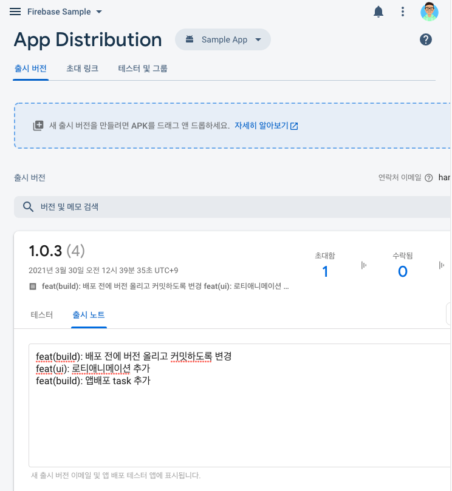

# Firebase-App-Distribution-Plugin-Sample
🚀 A sample project using Firebase app distribution plugin


> Launch your app quickly and simply.
 
## How it works

1. Collect change logs from git and convert into a release notes.
2. Increase version from a property file.
3. Commit the version property file and tag with new version on git.
4. Build APK with new version
5. Upload and distribute the APK with release notes created from git logs. 

## How to do it

1. Run task `_1_updateVersion`
2. Run task `_2_buildAndDistribute`
3. ?
4. **PROFIT!!**

## For details...

### 1. How to create release notes

- Get last git tag.
- Collect git logs from last tag to latest commit.
- Write into a text file.

```groovy
def createReleaseNote() {
    def lastTag = {
        def stdout = new ByteArrayOutputStream()
        exec {
            commandLine 'git', 'describe', '--tags', '--abbrev=0'
            standardOutput = stdout
        }
        return stdout.toString().trim()
    }
    def stdout = new ByteArrayOutputStream()
    exec {
        // %h : git revision tag
        // %s : git log message
        // e.g) --format=%s : feat(res): Some description
        // e.g) --format=%h %s : d23ad2f feat(res): Some description
        commandLine 'git', 'log', "${lastTag()}..HEAD", '--oneline', '--format=%s'
        standardOutput = stdout
    }
    def text = stdout.toString().trim()
    new File("${rootDir}", "RELEASE_NOTE.txt").text = text
    return text
}
```

### 2. Update version property file

- Maintain version with properties

```groovy
def versionProp = {
    def versionProp = new Properties()
    versionProp.load(new FileInputStream("$project.rootDir/version.properties"))
    versionProp.each { prop ->
        project.ext.set(prop.key, prop.value)
    }
    return versionProp
}

def verCode = {
    def prop = versionProp()
    return Integer.valueOf("${prop['version_code']}")
}

def verName = {
    def prop = versionProp()
    return "${prop['version_name']}"
}
```

- When bump to next version...

```groovy
def updateVersionProperties(name, code) {
    def versionProp = new File("${rootDir}", 'version.properties')
    def newVersion = name.substring(0, name.lastIndexOf('.')) +
            ".${Integer.valueOf(name.split('\\.').last()) + 1}"
    versionProp.text = "version_name=${newVersion}\n" +
            "version_code=${code + 1}"
}
```

### 3. Commit version property file

```groovy
def gitCommitAndTagVersion(releaseNote, verName) {
    try { exec { commandLine 'git', 'reset', 'HEAD' } } catch(Exception e) { }
    try { exec { commandLine 'git', 'add', "${rootDir}/version.properties" } } catch(Exception e) { }
    try { exec { commandLine 'git', 'commit', '-m', "v${verName} is released\n\n${releaseNote}" } } catch(Exception e) { }
    try {
        exec {
            commandLine 'git', 'tag', "v${verName}"
            commandLine 'git', 'tag', "v${verName}"
        }
    } catch (Exception e) {
        e.printStackTrace()
    }
}
```

### 4. Upload and distribute APK file on Firebase

- Add classpath firebase plugin into `build.gradle`(root).

```groovy
buildscript {
    repositories {
        google()
    }
    dependencies {
        classpath 'com.google.firebase:firebase-appdistribution-gradle:2.1.0'
    }
}
```

- Apply firebase plugin 

```groovy
plugins {
    id 'com.google.firebase.appdistribution'
}
```

```groovy
android {
    ...
    buildTypes {
        ...
        debug {
            ...
            firebaseAppDistribution {
                releaseNotesFile = "${rootDir}/RELEASE_NOTE.txt"
                testers = "qatester@test.moc"
            }
        }
    }
}
```

- Run task `appDistributionUploadDebug` or create a task depends on it.



## Test your app


## LICENSE
```
MIT License

Copyright (c) 2021 Haenala Shin

Permission is hereby granted, free of charge, to any person obtaining a copy
of this software and associated documentation files (the "Software"), to deal
in the Software without restriction, including without limitation the rights
to use, copy, modify, merge, publish, distribute, sublicense, and/or sell
copies of the Software, and to permit persons to whom the Software is
furnished to do so, subject to the following conditions:

The above copyright notice and this permission notice shall be included in all
copies or substantial portions of the Software.

THE SOFTWARE IS PROVIDED "AS IS", WITHOUT WARRANTY OF ANY KIND, EXPRESS OR
IMPLIED, INCLUDING BUT NOT LIMITED TO THE WARRANTIES OF MERCHANTABILITY,
FITNESS FOR A PARTICULAR PURPOSE AND NONINFRINGEMENT. IN NO EVENT SHALL THE
AUTHORS OR COPYRIGHT HOLDERS BE LIABLE FOR ANY CLAIM, DAMAGES OR OTHER
LIABILITY, WHETHER IN AN ACTION OF CONTRACT, TORT OR OTHERWISE, ARISING FROM,
OUT OF OR IN CONNECTION WITH THE SOFTWARE OR THE USE OR OTHER DEALINGS IN THE
SOFTWARE.

```
